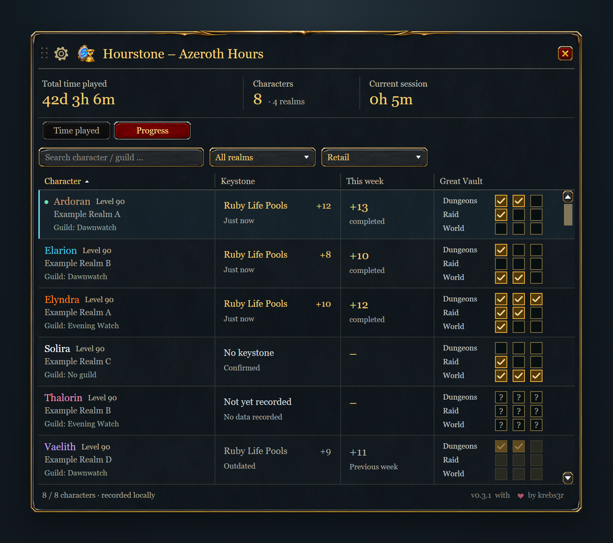

<p align="center"></p>

# Hourstone – Azeroth Hours

**Your characters. Your time.**

Track your World of Warcraft characters and their total `/played` time in one compact window. In Retail, switch to **Progress** to check keystones, your weekly Mythic+ best and Great Vault slots across your characters. Search by character or guild, filter realms and client families, and size the window up to 200%. German and English interfaces are included.

[Download](https://github.com/krebs3r/hourstone-azeroth-hours/releases/latest) · [CurseForge](https://www.curseforge.com/wow/addons/hourstone-azeroth-hours) · [Deutsche Anleitung](docs/DEUTSCH.md) · [Report an issue](https://github.com/krebs3r/hourstone-azeroth-hours/issues)


The character overview puts realm and client filters beside the search and shows each character's guild and playtime. Images show the implemented interface rendered with example characters.

## Installation

1. Download the `Hourstone-X.Y.Z.zip` asset from GitHub Releases or install through CurseForge.
2. Exit WoW and extract the ZIP into the client's `Interface/AddOns` directory.
3. Confirm the result is `Interface/AddOns/Hourstone/Hourstone.toc`, enable Hourstone and log in.

Repeat for each installation. The addon runs independently without another addon or an external account. GitHub's source archives are intended for development.

## Features and controls

- Character name, class, level, realm and guild, with a separate client column beside playtime and last update.
- Search by character or guild, realm and client filters together above the table, sortable columns, total and filtered playtime.
- Decimal hours or days / hours / minutes, plus the current login session.
- Delete entries from the overview without losing their saved playtime; restore them from a separate list.
- Retail **Time played / Progress** tabs with the current keystone, highest completed Mythic+ level this week and nine Great Vault slots.
- Entry in WoW's **Addons menu** below the clock where the client provides it: left click opens or closes Hourstone. On those clients the draggable minimap button is off by default after the update and can be turned back on in the settings or with `/hourstone minimap`.
- Movable window, 65–200% size setting in 5% steps and optional draggable minimap button. Larger scales show fewer rows and scroll; the window only shrinks when its width or minimum height cannot fit.
- `/hourstone` or `/azerothhours`: open or close; `/hourstone minimap`: show or hide the minimap button; `/hourstone reset`: reset window position.

Use the gear button for display settings and drag the title bar to move the window. Version 0.3.1 fixes the window jumping back during a drag; its position is saved when you release it. Click column headings to sort, including client names, scroll longer lists, and hover a character for full details. Unknown client families sort last. Tooltips show the recorded data and the last server timestamp without claiming an online/offline status.

## Retail progress



The **Progress** tab keeps the character, realm and guild beside the current keystone, the highest completed Mythic+ level this week, and three slots each for Dungeon, Raid and World activities. Hover a progress cell or Vault row for details and its capture time. The gear menu controls size up to 200%; search and realm/client filters work in both views. Classic clients keep the playtime view.

Hourstone reads the logged-in character's keystone, localized dungeon name, completed weekly runs and Vault thresholds from Blizzard's APIs. Completed overtime runs count toward the weekly best; abandoned runs do not. Dungeon abbreviations and seasonal thresholds are not hard-coded. A dungeon name may be shortened to fit, but its key level stays visible and the tooltip contains the full name.

Each character must be visited with this version before its progress can be recorded. Offline characters show the last captured data. **No keystone**, **Not yet recorded** and **Outdated** are distinct states; a weekly reset makes old progress stale until a new observation. Previous rewards are not presented as this week's progress, and temporary or protected API values do not erase valid data.

WoW saves locally recorded progress at logout or `/reload`. Companion versions supporting [protocol 4](docs/sync-protocol-v4.md) can synchronize it between selected installations and accounts. Received progress is displayed alongside local observations without becoming a local measurement. Older Companions continue to synchronize playtime, guilds and delete/restore controls.

## Deleting and restoring overview entries

Right-click a character and confirm **Delete** to hide it from the overview and its totals. This never deletes a WoW character or its saved playtime. In the gear menu, choose **Deleted characters**, then right-click an entry to restore it. Use the same menu to return to tracked characters. The summary cards always exclude deleted entries, including while browsing that list.

A new login with that character also restores deletions already known to the addon. Deleting your currently played character's entry keeps it hidden until you restore it or log in again; its time continues to be recorded. `/reload`, zoning and `/played` do not restore it. If another PC deleted the entry while this PC was offline, synchronize first and then make a new character login. These changes are saved with the normal WoW logout/reload and exchanged by Companion.

## Tracking and saved data

A character appears after its first login with Hourstone enabled. The server's `/played` total includes time played before installation. Unvisited characters cannot be discovered automatically. Between server responses, only the active character's displayed time advances locally. Requests are separated by at least 60 seconds. AFK time counts; offline time does not.

The session continues through a UI reload identified by WoW and resets at a new login. Data is saved as `HourstoneDB` per installation and WoW account at logout or reload. A crash can lose unsaved changes.

Guild membership is recorded for each character when you play it. Guild changes and leaving a guild update independently of playtime. Characters without a recorded guild status show **Not yet recorded**; log in with Hourstone 0.2.1 or later and log out or `/reload` to make the guild available to the companion. **No guild** means the character was confirmed to be guildless. The last saved status is shown for offline characters.

## Optional synchronization

**Progress synchronization requires Companion 0.2.0 on every participating PC.**
Companion 0.2.0 has been submitted for Microsoft Store certification and is not
yet publicly available at this release. Existing Companion versions remain
compatible with their playtime, guild and visibility features.

Hourstone 0.3.2 supports [protocol 4](docs/sync-protocol-v4.md) with a compatible [Hourstone Companion](https://github.com/krebs3r/hourstone-companion), including Retail progress, guild membership and shared delete/restore controls. Companion 0.1.3–0.1.6 remains compatible for the existing protocol-3 features. Upgrading from the public 0.1.1 release migrates saved data to schema 3 while preserving existing characters and settings. An upgrade from 0.2.2 or later keeps SavedVariables schema 3 without another migration. Legacy protocol 1–3 input remains readable; Hourstone 0.1.x does not support the Companion. New Companions read the local progress cache from 0.3.1, but send progress back only to an addon advertising protocol-4 support.

WoW first saves by logging out or using `/reload`. The Companion reads the saved observations from your selected installations and accounts, combines them and makes the shared overview available to the addon. Hourstone reads that overview on the next login or `/reload`. After the initial installation of the Companion data addon, fully close and restart WoW once. Between PCs, choose a folder that Dropbox, OneDrive or another service synchronizes and keeps available locally on each device; the Companion exchanges device snapshots through that folder.

[Hourstone Companion 0.1.6 for Windows 11 x64](https://github.com/krebs3r/hourstone-companion/releases/tag/v0.1.6) is available as an installer or portable package. This is an unsigned preview release. Its repository contains setup information and source code. Hourstone remains fully usable on its own.

Repeated observations of the same character are merged, never added. Confirmed server measurements are stored separately from local estimates. UI settings, request timing and the current session remain local. Synchronization cannot transfer `/played` between distinct characters, fetch unvisited characters or update a running client in real time. The companion's documentation explains setup, backups and limitations.

## Supported clients

| Client family | Declared interface |
| --- | ---: |
| Retail | 120100 |
| Mists of Pandaria Classic | 50504 |
| Burning Crusade Classic Anniversary | 20506 |
| Classic Era | 11509 |
| WoW: Forever (beta) | 16001 |

WoW: Forever uses the Retail API but keeps Hourstone's Classic design and playtime view; keystones and the Great Vault do not exist there. Its characters are recorded under the Retail client family, because Companion protocol 4 has no separate Forever family. Hardcore and Season of Discovery use the Era interface and have not been separately verified. See [validation](docs/VALIDATION.md) for current in-game coverage and automated checks.

## Development

Use Python 3.12:

```sh
python -m pip install -r requirements-dev.txt
python tools/install_hooks.py
python tools/privacy_guard.py
python tests/run.py
python -m unittest discover -s tests -p 'test_*.py'
python tools/package.py
```

The local pre-push hook and CI check the current tree and every new commit for private material. Keep local exports, logs and credentials outside Git. [Repository checks](docs/REPOSITORY.md) explains the historical baseline and checks.

`tools/assets.py` regenerates shipping TGA textures from retained PNG masters and source manifests. Packaging validates metadata, files, textures, licenses and deterministic ZIP output. `tools/preview.py` renders the current Lua layout with synthetic data and approximate browser fonts; native checks remain necessary. Add `--product-pages` to generate German and English product layouts for documentation images in `dist`.

See the [changelog](CHANGELOG.md), [validation guide](docs/VALIDATION.md) and [publishing guide](docs/curseforge/README.md).

## License and artwork

[MIT](LICENSE), © 2026 krebs3r. Hourstone shares its visual style with [Soundstone – Azeroth Audio](https://github.com/krebs3r/soundstone-azeroth-audio). Soundstone artwork retains its MIT license, and bundled fonts retain their SIL Open Font Licenses. See [artwork](docs/ARTWORK.md) and [font provenance](docs/FONTS.md). World of Warcraft is a trademark of Blizzard Entertainment; Hourstone is an independent community addon.
