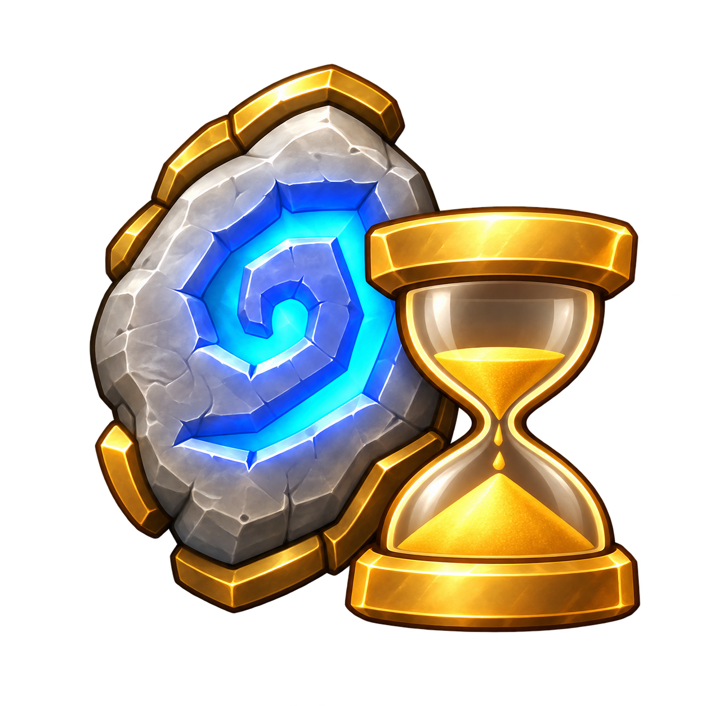
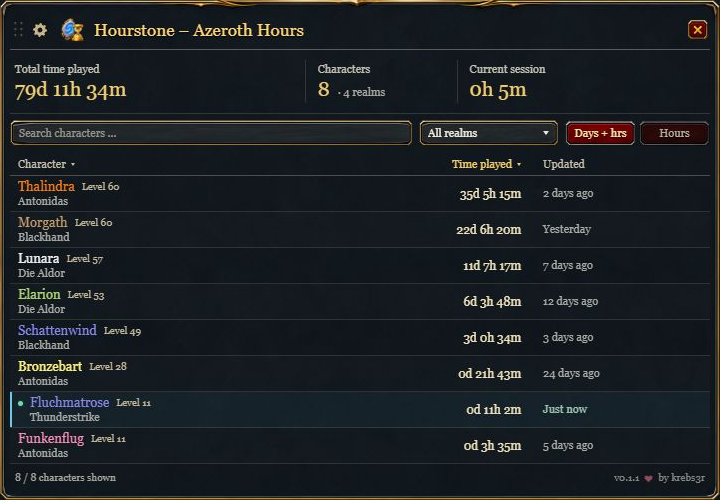
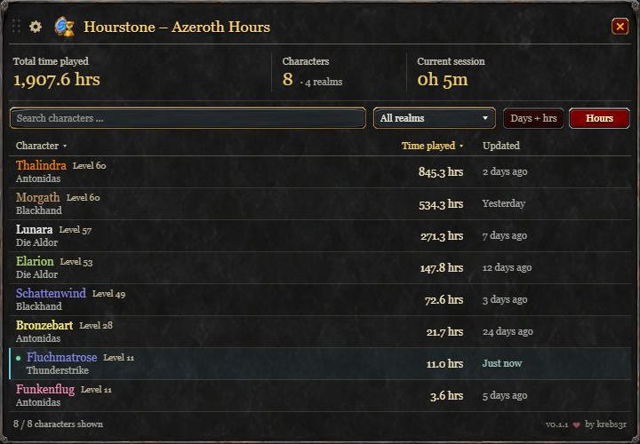
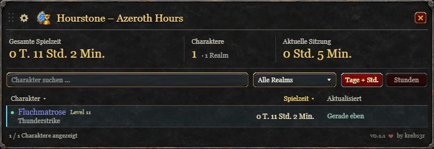

<p align="center"></p>

# Hourstone – Azeroth Hours

**Your characters. Your time.**

Track your World of Warcraft characters and their total playtime in one compact window. Hourstone brings together each character's `/played` total, with search, realm filters and a combined overview of your time in Azeroth. No additional addons are required.

[Download Hourstone 0.1.1](https://github.com/krebs3r/hourstone-azeroth-hours/releases/download/v0.1.1/Hourstone-0.1.1.zip) · [CurseForge](https://www.curseforge.com/wow/addons/hourstone-azeroth-hours) · [Deutsche Anleitung](docs/DEUTSCH.md) · [Report an issue](https://github.com/krebs3r/hourstone-azeroth-hours/issues)

## Why I built Hourstone

Hourstone grew out of something I've wanted in the Battle.net launcher for years: a clear overview of my playtime. I wanted to see how much time I've spent in Azeroth and how it's spread across my characters, so I built an addon that brings those numbers together in one place.

Hourstone shares its visual style with [Soundstone – Azeroth Audio](https://github.com/krebs3r/soundstone-azeroth-audio), with frames for Retail and Classic.

## Features

- Class-colored character names, level, realm, total playtime and last update.
- Total playtime across tracked characters, character count and current session, with totals for filtered results.
- Name search, realm filter and sortable columns. Highest playtime comes first.
- Switch between decimal hours (`312.5 hrs`) and days / hours / minutes (`13d 0h 30m`).
- Movable window with saved position and scale. Its height adjusts to the character list; longer lists scroll.
- Optional minimap button that can be moved or hidden.
- German on `deDE` clients, English on all other locales.
- No dependencies or external service. Your data stays in WoW's local SavedVariables.

## Interface previews

These design previews illustrate the layout using fictional characters and playtime. The in-game addon uses WoW's native fonts and has minor differences in its controls.

### Retail — character overview

Eight characters with playtime shown as days, hours and minutes.



### Classic — playtime in hours

The Classic frame with the decimal-hours display selected.



### Compact — one character

The window shrinks to fit the list. This example also shows the German interface.



## Supported clients

| Client family | Addon interface version | In-game testing |
| --- | ---: | --- |
| Retail (12.1.0) | 120100 | Confirmed (2026-09-15) |
| Mists of Pandaria Classic (5.5.4) | 50504 | Pending |
| Burning Crusade Classic Anniversary (2.5.6) | 20506 | Confirmed (2026-09-15) |
| Classic Era, Hardcore and Season of Discovery (1.15.9) | 11509 | Pending |

Version **0.1.1** has been tested in Retail and Burning Crusade Classic Anniversary. Support for the other listed clients is implemented but still awaits in-game testing. See the [validation report](docs/VALIDATION.md) for test coverage and outstanding checks. Historical private-server clients are not supported.

## Installation

1. Download **`Hourstone-0.1.1.zip`** from [GitHub Releases](https://github.com/krebs3r/hourstone-azeroth-hours/releases/tag/v0.1.1). GitHub's automatically generated source archives are for development.
2. Exit WoW, extract the ZIP into the relevant client's `Interface/AddOns` folder.
3. Confirm the result is **`Interface/AddOns/Hourstone/Hourstone.toc`**.
4. Enable Hourstone in the character selection AddOns list and log in.

Repeat for each WoW installation you use. No extra addon or library is required.

## Usage

| Control | Action |
| --- | --- |
| `/hourstone` or `/azerothhours` | Open / close the window |
| `/hourstone minimap` | Toggle the minimap button, even when hidden |
| `/hourstone reset` | Reset the window position |
| Drag the title bar | Move the window |
| Gear button | Minimap visibility, size slider and position reset |
| Character heading | Menu for name, level or realm sorting; select again to reverse |
| Playtime / Updated heading | Sort directly; click again to reverse |
| Mouse wheel | Scroll characters or a long realm menu |
| Escape or red X | Close the window |

Hover a character for its full name, realm and last server synchronization. Long text is shortened in rows so columns remain readable.

## How tracking works

Each character appears after its first login with Hourstone enabled. Hourstone reads the server's complete `/played` total, including time played before installation. Characters you have not logged into with the addon enabled cannot be added automatically.

Playtime refreshes at login and when you open the window, with at least **60 seconds between requests**. Between server updates, Hourstone keeps the active character's time running locally. Until the first response arrives, it shows the last known value or “Not yet available”. Automatic updates may also display WoW's normal `/played` message in chat.

The current session continues through `/reload` when WoW identifies it as a UI reload; a new login starts a new session. AFK time counts, as it does in `/played`. Offline time does not.

### Saved data and limitations

Data is stored locally in WoW's SavedVariables as `HourstoneDB`, **per installation and WoW account**. Retail and Classic installations keep separate character lists. Names, levels and realms update while you play.

WoW saves the data on normal logout or UI reload. A crash may lose changes since the last save. Character creation dates, import/export, daily or weekly statistics and removal of tracked characters are not available in this version.

## Feedback

Found a problem? [Open an issue](https://github.com/krebs3r/hourstone-azeroth-hours/issues) with your WoW client version, Hourstone version and the steps to reproduce it. Include a screenshot or Lua error message if available.

## Development

Development requires Python 3.12 and the dependencies in `requirements-dev.txt`:

```sh
python -m pip install -r requirements-dev.txt
python tests/run.py
python -m unittest discover -s tests -p 'test_*.py'
python tools/package.py --tag v0.1.1
```

`tools/assets.py` regenerates the shipping TGA textures from the PNG masters. Packaging validates the TOC, version, client interfaces, referenced files, texture headers and ZIP structure. Builds are deterministic and include a SHA-256 file.

`python tools/preview.py` generates a browser preview from the Lua frame definitions for layout review. Fonts and native controls are approximated; visual changes still need to be checked in game.

Pushes and pull requests run the **Validate** workflow and produce an installable ZIP. The **Release** workflow publishes version tags after the same checks pass.

See the [changelog](CHANGELOG.md), [validation report](docs/VALIDATION.md) and [German testing guide](docs/TESTING-0.1.1-DE.md) for release history and testing details.

## License and artwork

[MIT](LICENSE), © 2026 krebs3r. Includes Soundstone frame textures under the same license. Bundled Gelasio and Selawik fonts retain their respective SIL Open Font Licenses; see [font provenance](docs/FONTS.md). See [artwork provenance](docs/ARTWORK.md). World of Warcraft is a trademark of Blizzard Entertainment; Hourstone is an independent community addon.
