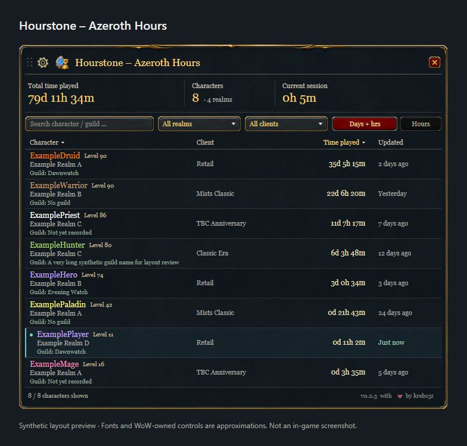

<p align="center"></p>

# Hourstone – Azeroth Hours

**Your characters. Your time.**

Track your World of Warcraft characters and their total `/played` time in one compact window. Search characters, filter realms and client families, and see both total playtime and the current session. German and English interfaces are included.

[Download](https://github.com/krebs3r/hourstone-azeroth-hours/releases/latest) · [CurseForge](https://www.curseforge.com/wow/addons/hourstone-azeroth-hours) · [Deutsche Anleitung](docs/DEUTSCH.md) · [Report an issue](https://github.com/krebs3r/hourstone-azeroth-hours/issues)



Synthetic layout preview with fictional characters. Browser fonts and WoW-owned controls approximate the native UI; this is not an in-game screenshot.

## Installation

1. Download the `Hourstone-X.Y.Z.zip` asset from GitHub Releases or install through CurseForge.
2. Exit WoW and extract the ZIP into the client's `Interface/AddOns` directory.
3. Confirm the result is `Interface/AddOns/Hourstone/Hourstone.toc`, enable Hourstone and log in.

Repeat for each installation. The addon runs independently without another addon or an external account. GitHub's source archives are intended for development.

## Features and controls

- Character name, class, level, realm and guild, with a separate client column beside playtime and last update.
- Search by character or guild, realm and client filters together above the table, sortable columns, total and filtered playtime.
- Decimal hours or days / hours / minutes, plus the current login session.
- Delete entries from the overview without losing their saved playtime; restore them from a separate list.
- Movable window, 65–130% size setting and optional draggable minimap button.
- `/hourstone` or `/azerothhours`: open or close; `/hourstone minimap`: show or hide the minimap button; `/hourstone reset`: reset window position.

Use the gear button for display settings. Click column headings to sort, including client names, scroll longer lists, and hover a character for full details. Unknown client families sort last. Tooltips show the recorded data and the last server timestamp without claiming an online/offline status.

## Deleting and restoring overview entries

Right-click a character and confirm **Delete** to hide it from the overview and its totals. This never deletes a WoW character or its saved playtime. In the gear menu, choose **Deleted characters**, then right-click an entry to restore it. Use the same menu to return to tracked characters. The summary cards always exclude deleted entries, including while browsing that list.

A new login with that character also restores deletions already known to the addon. Deleting your currently played character's entry keeps it hidden until you restore it or log in again; its time continues to be recorded. `/reload`, zoning and `/played` do not restore it. If another PC deleted the entry while this PC was offline, synchronize first and then make a new character login. These changes are saved with the normal WoW logout/reload and exchanged by Companion.

## Tracking and saved data

A character appears after its first login with Hourstone enabled. The server's `/played` total includes time played before installation. Unvisited characters cannot be discovered automatically. Between server responses, only the active character's displayed time advances locally. Requests are separated by at least 60 seconds. AFK time counts; offline time does not.

The session continues through a UI reload identified by WoW and resets at a new login. Data is saved as `HourstoneDB` per installation and WoW account at logout or reload. A crash can lose unsaved changes.

Guild membership is recorded for each character when you play it. Guild changes and leaving a guild update independently of playtime. Characters without a recorded guild status show **Not yet recorded**; log in with Hourstone 0.2.1 or later and log out or `/reload` to make the guild available to the companion. **No guild** means the character was confirmed to be guildless. The last saved status is shown for offline characters.

## Optional synchronization

Hourstone 0.2.3 supports [protocol 3](docs/sync-protocol-v3.md) with the separate [Hourstone Companion](https://github.com/krebs3r/hourstone-companion) 0.1.3 or later, including guild membership and shared delete/restore controls. Upgrading from the public 0.1.1 release migrates saved data to schema 3 while preserving existing characters and settings. An upgrade from the 0.2.2 development build keeps the same protocol and schema without another migration. Legacy protocol 1 and 2 input remains readable; Hourstone 0.1.x does not support the Companion.

WoW first saves by logging out or using `/reload`. The Companion reads the saved observations from your selected installations and accounts, combines them and makes the shared overview available to the addon. Hourstone reads that overview on the next login or `/reload`. After the initial installation of the Companion data addon, fully close and restart WoW once. Between PCs, choose a folder that Dropbox, OneDrive or another service synchronizes and keeps available locally on each device; the Companion exchanges device snapshots through that folder.

The Windows Companion is currently a source/development preview; a signed public installer is not yet available. Its repository contains setup information and release status. Hourstone remains fully usable on its own.

Repeated observations of the same character are merged, never added. Confirmed server measurements are stored separately from local estimates. UI settings, request timing and the current session remain local. Synchronization cannot transfer `/played` between distinct characters, fetch unvisited characters or update a running client in real time. The companion's documentation explains setup, backups and limitations.

## Supported clients

| Client family | Declared interface |
| --- | ---: |
| Retail | 120100 |
| Mists of Pandaria Classic | 50504 |
| Burning Crusade Classic Anniversary | 20506 |
| Classic Era | 11509 |

The 0.1.1 release has reported in-game coverage for these four families. Hardcore and Season of Discovery use the Era interface and have not been separately verified. The new synchronization flow still requires native-client acceptance testing; see [validation](docs/VALIDATION.md).

## Development

Use Python 3.12:

```sh
python -m pip install -r requirements-dev.txt
python tools/install_hooks.py
python tools/privacy_guard.py
python tests/run.py
python -m unittest discover -s tests -p 'test_*.py'
python tools/package.py
```

The local pre-push hook and CI check the current tree and every new commit for private material. Keep local exports, logs and credentials outside Git. [Repository checks](docs/REPOSITORY.md) explains the historical baseline and checks.

`tools/assets.py` regenerates shipping TGA textures from retained PNG masters and source manifests. Packaging validates metadata, files, textures, licenses and deterministic ZIP output. `tools/preview.py` renders the current Lua layout with synthetic data and approximate browser fonts; native checks remain necessary. Add `--product-pages` to generate explicitly labeled German and English layouts for documentation images in `dist`.

See the [changelog](CHANGELOG.md), [validation guide](docs/VALIDATION.md) and [publishing guide](docs/curseforge/README.md).

## License and artwork

[MIT](LICENSE), © 2026 krebs3r. Hourstone shares its visual style with [Soundstone – Azeroth Audio](https://github.com/krebs3r/soundstone-azeroth-audio). Soundstone artwork retains its MIT license, and bundled fonts retain their SIL Open Font Licenses. See [artwork](docs/ARTWORK.md) and [font provenance](docs/FONTS.md). World of Warcraft is a trademark of Blizzard Entertainment; Hourstone is an independent community addon.
