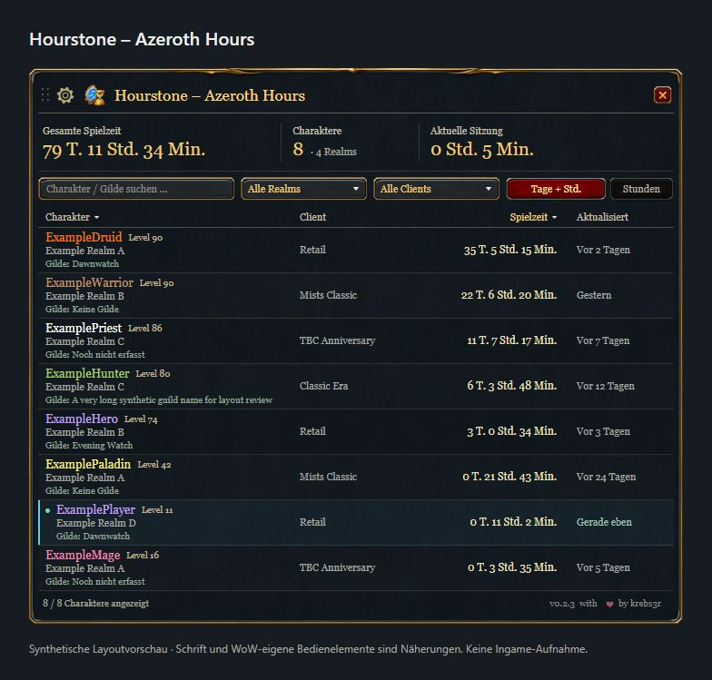

# Hourstone – Azeroth Hours

Hourstone zeigt die gesamte `/played`-Zeit deiner erfassten World-of-Warcraft-Charaktere, die Gesamtspielzeit und die aktuelle Sitzung in einem kompakten Fenster. Suche, Filter, Sortierung und zwei Zeitformate erleichtern die Übersicht.

Layoutvorschau mit fiktiven Charakteren. Schrift und WoW-eigene Bedienelemente sind Browser-Näherungen; dies ist keine Ingame-Aufnahme.

## Installation und Bedienung

Lade das ZIP aus [GitHub Releases](https://github.com/krebs3r/hourstone-azeroth-hours/releases/latest) oder installiere über [CurseForge](https://www.curseforge.com/wow/addons/hourstone-azeroth-hours). Beende WoW und entpacke den Ordner `Hourstone` nach `Interface/AddOns` des gewünschten Clients. Aktiviere das Addon und melde dich an.

- `/hourstone` oder `/azerothhours` öffnet und schließt das Fenster.
- `/hourstone minimap` schaltet den Minimap-Button um; `/hourstone reset` setzt die Fensterposition zurück.
- Das Zahnrad öffnet Einstellungen für Minimap und Größe. Ziehe die Titelleiste, um das Fenster zu verschieben.
- Die Suche nach Charakter oder Gilde sowie die danebenstehenden Realm- und Clientfilter grenzen die Liste ein. Die Clientspalte steht links neben der Spielzeit. Spaltenüberschriften sortieren die Liste; unbekannte Clients stehen dabei zuletzt. Das Mausrad bewegt längere Listen.
- Der Minimap-Button verwendet Blizzards Rahmen, Hintergrund und Hovereffekt mit vollständigem Hourstone-Logo. Seine gespeicherte Position bleibt erhalten.
- Ein Charakter-Tooltip zeigt alle gespeicherten Details und den Zeitpunkt des letzten Serverabgleichs auf einer Zeile. Er behauptet keinen Online-/Offline-Status.

## Einträge aus der Übersicht löschen und wiederherstellen

Klicke mit der rechten Maustaste auf einen Charakter und bestätige **Löschen**, um den Eintrag aus der Übersicht und ihren Summen auszublenden. Sein gespeicherter Spielzeitstand bleibt erhalten; dein WoW-Charakter wird niemals gelöscht. Unter Zahnrad → **Gelöschte Charaktere** findest du ausgeblendete Einträge. Ein Rechtsklick stellt den gewählten Eintrag wieder her. Über dasselbe Menü wechselst du zurück. Die Kennzahlen zählen auch in dieser Ansicht ausschließlich die Einträge der normalen Übersicht.

Ein neuer Login mit diesem Charakter stellt bereits bekannte Löschungen aus der Übersicht ebenfalls wieder her. Löschst du den Eintrag des aktuell gespielten Charakters, bleibt er bis zum Wiederherstellen oder nächsten Login ausgeblendet; seine Spielzeit wird weiter erfasst. `/reload`, Gebietswechsel und `/played` stellen ihn nicht wieder her. Wurde der Eintrag auf einem anderen PC gelöscht, während dieser Rechner offline war, muss zuerst synchronisiert und danach neu mit dem Charakter eingeloggt werden. Löschungen und Wiederherstellungen werden beim normalen Logout/Reload gespeichert und vom Companion abgeglichen.

## Erfasste Zeit

Ein Charakter erscheint nach dem ersten Login mit aktiviertem Addon. Sein serverseitiger `/played`-Wert enthält auch die Zeit vor der Installation. Noch nicht besuchte Charaktere lassen sich nicht automatisch abfragen.

Zwischen Serverantworten zählt Hourstone die Zeit des aktiven Charakters lokal weiter. Anfragen erfolgen mit mindestens 60 Sekunden Abstand. AFK-Zeit zählt, Offline-Zeit nicht. Eine von WoW erkannte UI-Neuladung setzt die Sitzung fort; ein neuer Login startet eine neue Sitzung.

Die Daten liegen in `HourstoneDB`, getrennt je Installation und WoW-Account. WoW speichert beim regulären Logout oder Reload. Ein Absturz kann noch nicht gespeicherte Änderungen verlieren.

## Gilde

Die Charakterliste zeigt auch die zuletzt erfasste Gilde. Gildenwechsel und Austritt werden beim Spielen erfasst, ohne die Spielzeit zu verändern. „Keine Gilde“ ist ein bestätigter Zustand; „Noch nicht erfasst“ bedeutet, dass noch keine Gildeninformation vorliegt. Logge dich mit dem jeweiligen Charakter und Hourstone 0.2.1 oder neuer ein und führe anschließend `/reload` aus oder logge dich aus. Danach kann der Companion diese Information übernehmen. Bei ausgeloggten Charakteren bleibt der letzte gespeicherte Stand sichtbar.

## Optionaler Abgleich zwischen Clients

Hourstone 0.2.3 unterstützt [Protokoll 3](sync-protocol-v3.md) des separaten [Hourstone Companion](https://github.com/krebs3r/hourstone-companion) ab 0.1.3 einschließlich Gildendaten sowie Löschen und Wiederherstellen von Übersichtseinträgen. Protokoll und gespeichertes Schema bleiben gegenüber 0.2.2 unverändert; vorhandene Daten und Einstellungen benötigen keine Migration. Aktualisiere Addon und Companion gemeinsam auf allen Rechnern. Alte Eingaben mit Protokoll 1 und 2 bleiben lesbar. Der Companion führt gespeicherte Charakterdaten ausgewählter lokaler Installationen zusammen, sobald alle WoW-Clients beendet sind. Beim nächsten Start zeigt Hourstone die gemeinsame Übersicht mit Clientfilter. Über einen gemeinsamen Ordner kann der Companion auch Gerätestände zwischen PCs austauschen. Die veröffentlichten Hourstone-Versionen 0.1.x unterstützen dieses Protokoll noch nicht.

Doppelte Stände desselben Charakters werden zusammengeführt und niemals addiert. Bestätigte Serverwerte bleiben von lokalen Schätzungen getrennt. Fensterposition, Einstellungen, Anfragen und die laufende Sitzung bleiben lokal. Der Abgleich überträgt keine `/played`-Zeit zwischen unterschiedlichen Charakteren und ist kein Live-Abgleich während des Spiels. Einrichtung, Sicherungen und Grenzen stehen in der Companion-Anleitung.

Retail, Mists Classic, TBC Anniversary und Classic Era sind als Clientfamilien vorgesehen. Für Version 0.1.1 liegen Spieltests dieser vier Familien vor. Hardcore, Season of Discovery und der neue Companion-Ablauf benötigen gesonderte Prüfungen. Siehe [Validierung](VALIDATION.md).

Fehler bitte über [GitHub Issues](https://github.com/krebs3r/hourstone-azeroth-hours/issues) mit Addon-Version, Client-Build und Schritten zum Nachstellen melden. Keine Zugangsdaten, persönlichen Account-Pfade oder vollständigen Charakterdatenbanken anhängen.
