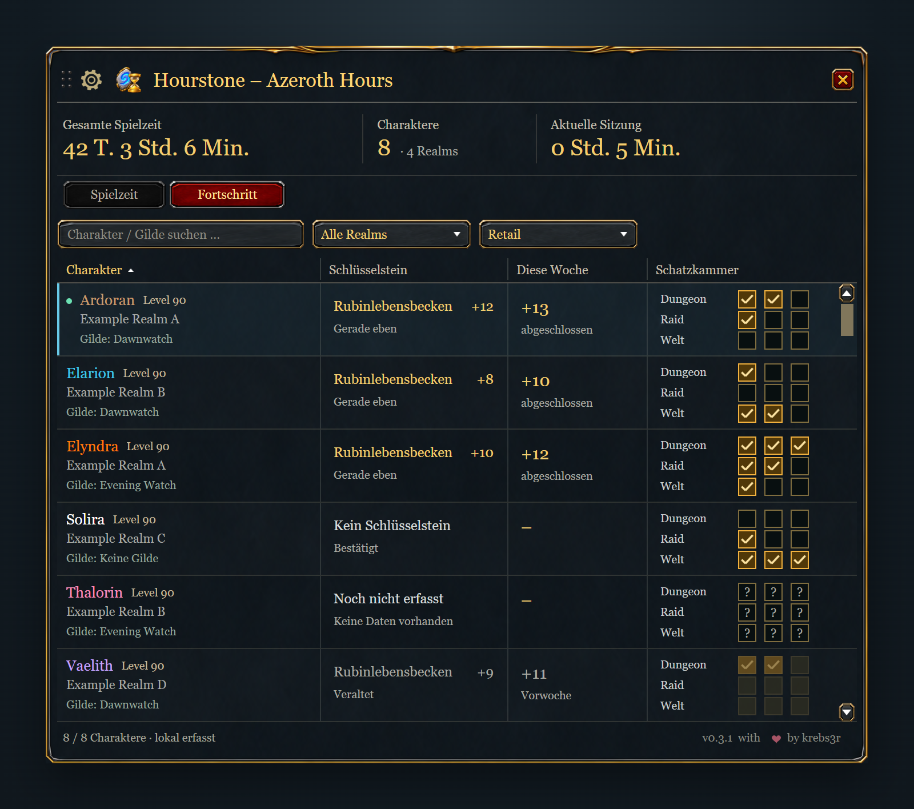

# Hourstone – Azeroth Hours

Hourstone zeigt die gesamte `/played`-Zeit deiner erfassten World-of-Warcraft-Charaktere, die Gesamtspielzeit und die aktuelle Sitzung in einem kompakten Fenster. In Retail zeigt die Ansicht **Fortschritt** außerdem Schlüsselsteine, die beste M+-Stufe dieser Woche und Schatzkammer-Slots. Suche, Filter, Sortierung und eine Fenstergröße bis 200 % erleichtern die Übersicht.

Die Charakterübersicht vereint Suche, Realm- und Clientfilter und zeigt Gilde und Spielzeit jedes Charakters. Die Bilder zeigen gerenderte Ansichten der Addon-Oberfläche mit Beispielcharakteren.

## Installation und Bedienung

Lade das ZIP aus [GitHub Releases](https://github.com/krebs3r/hourstone-azeroth-hours/releases/latest) oder installiere über [CurseForge](https://www.curseforge.com/wow/addons/hourstone-azeroth-hours). Beende WoW und entpacke den Ordner `Hourstone` nach `Interface/AddOns` des gewünschten Clients. Aktiviere das Addon und melde dich an.

- `/hourstone` oder `/azerothhours` öffnet und schließt das Fenster.
- Wo der Client es anbietet, steht Hourstone im **Addons-Menü** unter der Uhr; Linksklick öffnet und schließt das Fenster. Auf diesen Clients ist der Minimap-Button nach dem Update einmalig ausgeblendet und lässt sich in den Einstellungen oder mit `/hourstone minimap` wieder einblenden.
- `/hourstone minimap` schaltet den Minimap-Button um; `/hourstone reset` setzt die Fensterposition zurück.
- Das Zahnrad öffnet Einstellungen für Minimap und Größe (65–200 % in 5-%-Schritten). Bei hoher Skalierung erscheinen weniger Zeilen; das Mausrad erreicht alle Charaktere. Erst wenn Breite oder Mindesthöhe nicht passen, wird das Fenster verkleinert. Ziehe die Titelleiste, um es zu verschieben. Version 0.3.1 behebt das Zurückspringen während des Ziehens; beim Loslassen wird die gewählte Position gespeichert.
- Die Suche nach Charakter oder Gilde sowie die danebenstehenden Realm- und Clientfilter grenzen die Liste ein. Die Clientspalte steht links neben der Spielzeit. Spaltenüberschriften sortieren die Liste; unbekannte Clients stehen dabei zuletzt. Das Mausrad bewegt längere Listen.
- Der Minimap-Button verwendet Blizzards Rahmen, Hintergrund und Hovereffekt mit vollständigem Hourstone-Logo. Seine gespeicherte Position bleibt erhalten.
- Ein Charakter-Tooltip zeigt alle gespeicherten Details und den Zeitpunkt des letzten Serverabgleichs auf einer Zeile. Er behauptet keinen Online-/Offline-Status.

## Fortschritt in Retail

Mit **Spielzeit | Fortschritt** wechselst du die Ansicht im selben Fenster. Fortschritt zeigt neben Charakter, Realm und Gilde den eigenen Schlüsselstein, die höchste abgeschlossene M+-Stufe dieser Woche und je drei Schatzkammer-Slots für Dungeon, Raid und Welt. Tooltips zeigen vollständige Namen, Fortschritt, Schwierigkeit und Erfassungszeit. Suche und Realm-/Clientfilter gelten in beiden Ansichten. Classic behält die Spielzeitansicht.

Dungeonname, Schlüsselsteinstufe, Wochenabschlüsse und Slot-Schwellen stammen direkt aus WoW. Du musst keine Instanzen oder Saisonlisten pflegen. Abschlüsse außerhalb der Zeit zählen ebenfalls, abgebrochene Läufe nicht. Lange Namen werden in der Tabelle gekürzt; die Stufe bleibt sichtbar und der Tooltip enthält den vollständigen Namen.

Logge dich zunächst mit jedem gewünschten Charakter ein. Ausgeloggte Charaktere zeigen den letzten erfassten Stand. „Kein Schlüsselstein“, „Noch nicht erfasst“ und „Veraltet“ sind unterschiedliche Zustände. Nach dem Wochenreset werden alte Daten als veraltet markiert, bis sie neu erfasst wurden. Abholbare Vorwochenbelohnungen zählen nicht als aktueller Wochenfortschritt. Vorübergehend fehlende oder geschützte API-Werte löschen keine gültigen Daten.

WoW speichert lokal erfassten Fortschritt beim Logout oder `/reload`. Ein Companion mit [Protokoll 4](sync-protocol-v4.md) kann ihn zwischen ausgewählten Installationen und Accounts abgleichen. Empfangene Stände werden mit den lokalen Messungen angezeigt, aber nicht als neue lokale Messungen gespeichert. Ältere Companions übertragen weiterhin Spielzeit, Gilde sowie das Löschen und Wiederherstellen von Übersichtseinträgen.

## Einträge aus der Übersicht löschen und wiederherstellen

Klicke mit der rechten Maustaste auf einen Charakter und bestätige **Löschen**, um den Eintrag aus der Übersicht und ihren Summen auszublenden. Sein gespeicherter Spielzeitstand bleibt erhalten; dein WoW-Charakter wird niemals gelöscht. Unter Zahnrad → **Gelöschte Charaktere** findest du ausgeblendete Einträge. Ein Rechtsklick stellt den gewählten Eintrag wieder her. Über dasselbe Menü wechselst du zurück. Die Kennzahlen zählen auch in dieser Ansicht ausschließlich die Einträge der normalen Übersicht.

Ein neuer Login mit diesem Charakter stellt bereits bekannte Löschungen aus der Übersicht ebenfalls wieder her. Löschst du den Eintrag des aktuell gespielten Charakters, bleibt er bis zum Wiederherstellen oder nächsten Login ausgeblendet; seine Spielzeit wird weiter erfasst. `/reload`, Gebietswechsel und `/played` stellen ihn nicht wieder her. Wurde der Eintrag auf einem anderen PC gelöscht, während dieser Rechner offline war, muss zuerst synchronisiert und danach neu mit dem Charakter eingeloggt werden. Löschungen und Wiederherstellungen werden beim normalen Logout/Reload gespeichert und vom Companion abgeglichen.

## Erfasste Zeit

Ein Charakter erscheint nach dem ersten Login mit aktiviertem Addon. Sein serverseitiger `/played`-Wert enthält auch die Zeit vor der Installation. Noch nicht besuchte Charaktere lassen sich nicht automatisch abfragen.

Zwischen Serverantworten zählt Hourstone die Zeit des aktiven Charakters lokal weiter. Anfragen erfolgen mit mindestens 60 Sekunden Abstand. AFK-Zeit zählt, Offline-Zeit nicht. Eine von WoW erkannte UI-Neuladung setzt die Sitzung fort; ein neuer Login startet eine neue Sitzung.

Die Daten liegen in `HourstoneDB`, getrennt je Installation und WoW-Account. WoW speichert beim regulären Logout oder Reload. Ein Absturz kann noch nicht gespeicherte Änderungen verlieren.

## Gilde

Die Charakterliste zeigt auch die zuletzt erfasste Gilde. Gildenwechsel und Austritt werden beim Spielen erfasst, ohne die Spielzeit zu verändern. „Keine Gilde“ ist ein bestätigter Zustand; „Noch nicht erfasst“ bedeutet, dass noch keine Gildeninformation vorliegt. Logge dich mit dem jeweiligen Charakter und Hourstone 0.2.1 oder neuer ein und führe anschließend `/reload` aus oder logge dich aus. Danach kann der Companion diese Information übernehmen. Bei ausgeloggten Charakteren bleibt der letzte gespeicherte Stand sichtbar.

## Optionaler Abgleich zwischen Clients

**Für den Fortschrittsabgleich ist Companion 0.2.0 auf jedem beteiligten PC nötig.**
Companion 0.2.0 ist zur Microsoft-Store-Zertifizierung eingereicht und zum Zeitpunkt
dieses Releases noch nicht öffentlich verfügbar. Vorhandene Companion-Versionen
bleiben für Spielzeit, Gilden und Sichtbarkeit kompatibel.

Hourstone 0.3.2 unterstützt [Protokoll 4](sync-protocol-v4.md) eines kompatiblen [Hourstone Companion](https://github.com/krebs3r/hourstone-companion) einschließlich Retail-Fortschritt, Gildendaten sowie Löschen und Wiederherstellen von Übersichtseinträgen. Companion 0.1.3–0.1.6 bleibt für die bisherigen Protokoll-3-Funktionen kompatibel. Beim Upgrade von der veröffentlichten Version 0.1.1 werden die gespeicherten Daten auf Schema 3 umgestellt; Charaktere und Einstellungen bleiben erhalten. Bei einem Upgrade von 0.2.2 oder neuer bleibt das Hauptdatenschema 3 erhalten. Alte Eingaben mit Protokoll 1–3 bleiben lesbar. Ein neuer Companion kann lokale Fortschrittsdaten bereits aus 0.3.1 lesen; Fortschritt zurück ins Spiel senden kann er erst an ein Addon mit ausgewiesener Protokoll-4-Unterstützung. Hourstone 0.1.x unterstützt den Companion nicht.

WoW speichert zunächst beim Ausloggen oder mit `/reload`. Der Companion liest die gespeicherten Stände deiner ausgewählten Installationen und Accounts ein, führt sie zusammen und stellt die gemeinsame Übersicht für das Addon bereit. Hourstone übernimmt sie beim nächsten Login oder `/reload`. Nach der ersten Installation des Companion-Datenaddons WoW einmal vollständig schließen und neu starten. Für mehrere PCs einen Ordner wählen, den Dropbox, OneDrive oder ein anderer Dienst auf allen Geräten synchronisiert und dauerhaft lokal verfügbar hält. Darüber tauscht der Companion die Gerätestände aus.

[Hourstone Companion 0.1.6 für Windows 11 x64](https://github.com/krebs3r/hourstone-companion/releases/tag/v0.1.6) ist als Installer und portables Paket verfügbar. Dies ist eine unsignierte Vorschauversion. Einrichtung und Quellcode stehen im Companion-Repository. Das Addon bleibt eigenständig nutzbar.

Doppelte Stände desselben Charakters werden zusammengeführt und niemals addiert. Bestätigte Serverwerte bleiben von lokalen Schätzungen getrennt. Fensterposition, Einstellungen, Anfragen und die laufende Sitzung bleiben lokal. Der Abgleich überträgt keine `/played`-Zeit zwischen unterschiedlichen Charakteren und ist kein Live-Abgleich während des Spiels. Einrichtung, Sicherungen und Grenzen stehen in der Companion-Anleitung.

Retail, Mists Classic, TBC Anniversary und Classic Era sind unterstützte Clientfamilien. Dazu kommt die Beta von WoW: Forever (Interface 16001). Forever nutzt die Retail-API, zeigt Hourstone aber im Classic-Design und nur mit der Spielzeitansicht; Schlüsselsteine und Schatzkammer gibt es dort nicht. Forever-Charaktere werden unter der Clientfamilie Retail erfasst, weil Companion-Protokoll 4 keine eigene Forever-Familie kennt. Hardcore und Season of Discovery verwenden die Era-Schnittstelle und wurden nicht gesondert geprüft. Aktuelle Spieltests und automatische Prüfungen stehen in der [Validierung](VALIDATION.md).

Fehler bitte über [GitHub Issues](https://github.com/krebs3r/hourstone-azeroth-hours/issues) mit Addon-Version, Client-Build und Schritten zum Nachstellen melden. Keine Zugangsdaten, persönlichen Account-Pfade oder vollständigen Charakterdatenbanken anhängen.
